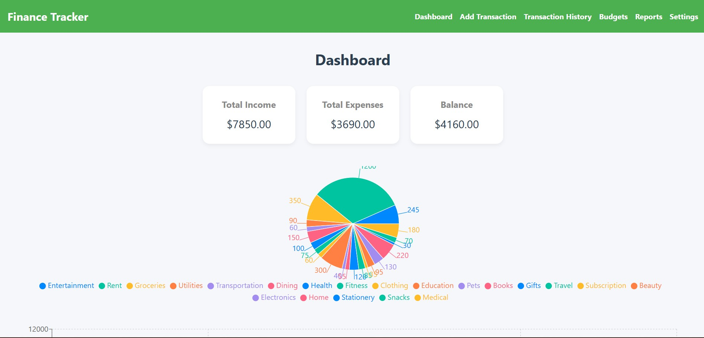
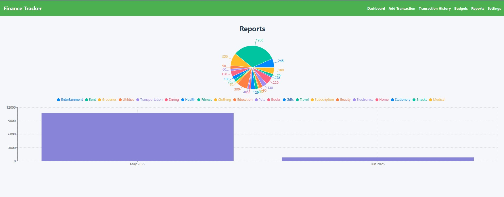
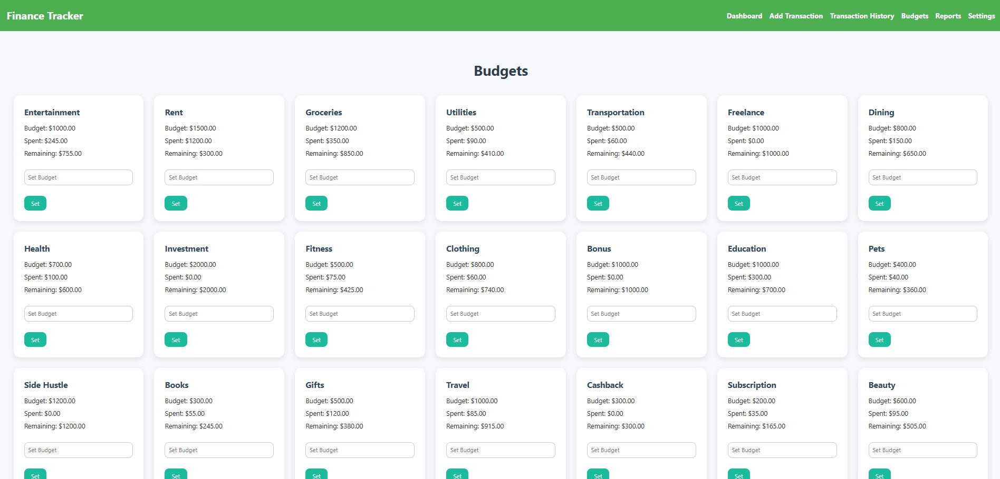
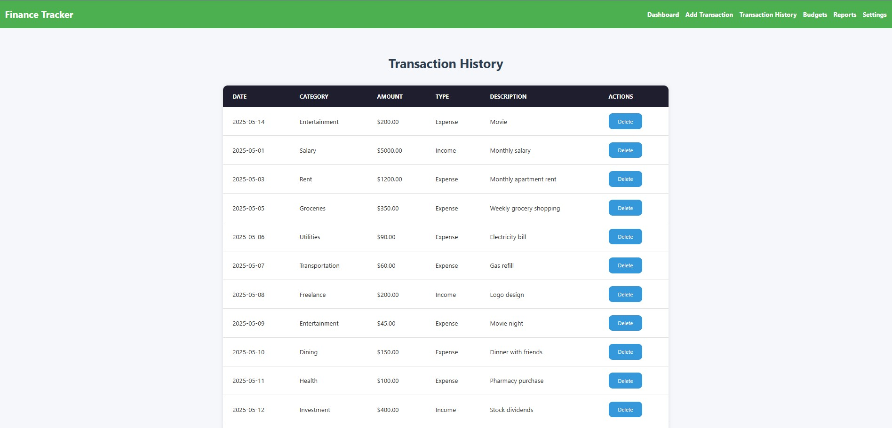

# 💰 Personal Finance Tracker Application

This is a **multi-page web application** built to help users manage their personal finances in a simple and visual way. The app allows users to track their **income, expenses, budgets**, and view **financial reports** using charts and tables.

## 📺 Project Demo
 [Live Demo](https://drive.google.com/file/d/1dC-kpyV-kiFeGndJNQXl23PgGsuVBo6j/view?usp=sharing)  
🎥 [Click here to watch the project demo video](https://drive.google.com/file/d/1dC-kpyV-kiFeGndJNQXl23PgGsuVBo6j/view?usp=sharing)  
You can also find it in the `assets` folder of this repository.

---

## 📄 Pages and Features

### 1. 🏠 Dashboard
- Displays a quick financial summary:
  - Total Income
  - Total Expenses
  - Remaining Budget
  - Total Savings
- Includes visual data charts:
  - Monthly spending trends (Bar/Line Chart)
  - Category-wise expense breakdown (Pie Chart)
- Key highlights like:
  - Top Expense Categories
  - Biggest Expense of the Month

> 💡 Implemented using chart libraries like Chart.js or Recharts.

---

### 2. ➕ Add Transaction Page
- A form to add new income or expense entries.
- Fields include:
  - Type (Income or Expense)
  - Amount
  - Category
  - Date
  - Optional Description
- Includes validation for required fields and number inputs.

---

### 3. 📜 Transaction History
- Shows all user transactions in a structured table.
- Features include:
  - Filtering by date range or category
  - Sorting by date, type, or amount
  - Pagination for easy viewing

---

### 4. 📊 Budgets
- Set monthly budgets for different categories.
- Visual indicators show budget consumption:
  - Progress bars for each category
- Alerts if a category's budget is exceeded.

---

### 5. 📈 Reports Page
- Generates detailed monthly and yearly reports.
- Visual comparison between income and expenses.

---

## 🛠 Tech Stack

- React.js (Frontend)
- Chart.js / Recharts (Data Visualization)
- JSON Server (Mock Backend)
- CSS / Tailwind (Styling)

  ## Important Points

- To see data run the db.json file on port 5000 { npx json-server --watch db.json --port 5000}

## 📸 Screenshots

### 🧾 Dashboard

---

### Reports

---

### Budget

---

### Transaction History

